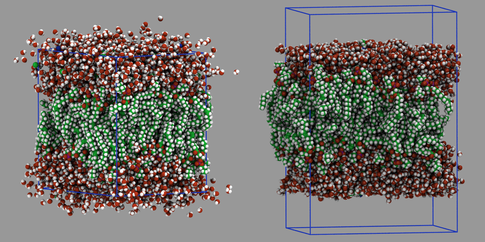

======================================
Convert a bulk system to a slab system
======================================

A regularly encountered simulation problem is how to convert a bulk
system that has been run for a while to equilibrate into a slab system
with some vacuum space.  The challenge here is that one cannot just
change the box dimensions with the :doc:`change_box command
<change_box>` or edit the box boundaries in a data file because some
atoms will have non-zero image flags from diffusing around.  Changing
the box dimensions results in an undesired displacement of those atoms,
since the image flags indicate how many times the box length in x-, y-,
or z-direction needs to be added or subtracted to get the "unwrapped"
coordinates.  By changing the box dimension this distance is changed and
thus those atoms move unphysically relative to their neighbors with zero
image flags.  Setting image flags forcibly to zero creates problems because
that could break apart molecules by have one atom of a bond on the top
of the system and the other at the bottom.

.. _bulk2slab:

   Snapshots of the bulk Rhodopsin system (right) and the slab geometry (left)

Below is a suggested workflow using the :doc:`Rhodopsin benchmark input
<Speed_bench>` for demonstration.  The figure shows the state before on
the left (with unwrapped atoms that have diffused out of the box) and
after on the right (with the vacuum added above and below).  The process
is done by modifying the ``in.rhodo`` input file.  The first lines up to
and including the :doc:`read_data command <read_data>` remain unchanged.
Then we insert the following lines to add vacuum to the z direction
above and below the system:

.. code-block:: LAMMPS

   variable       delta index 10.0
   reset_atoms    image all
   write_dump     all custom rhodo-unwrap.lammpstrj id xu yu zu
   change_box     all z final $(zlo-2.0*v_delta) $(zhi+2.0*v_delta) &
                      boundary p p f
   read_dump      rhodo-unwrap.lammpstrj 0 x y z box no replace yes
   kspace_modify  slab 3.0

Specifically, the :doc:`variable delta <variable>` (set to :math:`10
\AA`) represents a distance that determines the amount of vacuum added:
we add twice its value in each direction to the z-dimension; thus in
total :math:`40 \AA` get added.  The :doc:`reset_atoms image all
<reset_atoms>` command shall reset any image flags to become either 0 or
:math:`\pm 1` and thus have the minimum distance from the center of the
simulation box, but the correct relative distance for bonded atoms.

The :doc:`write_dump command <write_dump>` then writes out the resulting
*unwrapped* coordinates of the system.  After expanding the box,
coordinates that were outside the box should now be inside and the
unwrapped coordinates will become "wrapped", while atoms outside the
periodic boundaries will be wrapped back into the box and their image
flags in those directions restored.

The :doc:`change_box command <change_box>` adds the desired
distance to the low and high box boundary in z-direction and then changes
the :doc:`boundary to "p p f" <boundary>` which will force the image
flags in z-direction to zero and create an undesired displacement for
the atoms with non-zero image flags.

With the :doc:`read_dump command <read_dump>` we read back and replace
partially incorrect coordinates with the previously saved, unwrapped
coordinates.  It is important to ignore the box dimensions stored in the
dump file.  We want to preserve the expanded box.  Finally, we turn on
the slab correction for the PPPM long-range solver with the
:doc:`kspace_modify command <kspace_modify>` as required when using a
long range Coulomb solver for non-periodic z-dimension.

Next we replace the :doc:`fix npt command <fix_nh>` with:

.. code-block:: LAMMPS

   fix            2 nvt temp 300.0 300.0 10.0

We now have an open system and thus the adjustment of the cell in
z-direction is no longer required.  Since splitting of the bulk where
the vacuum is inserted, creates surface atoms with high potential
energy, we reduce the thermostat time constant from 100.0 to 10.0 to
remove excess kinetic energy resulting from that change faster.

Also the high potential energy of the surface atoms can cause that some
of them are ejected from the slab.  In order to suppress that, we add
soft harmonic walls to push back any atoms that want to leave the slab.
To determine the position of the wall, we first need to to determine the
extent of the atoms in z-direction and then place the harmonic walls
based on that information:

.. code-block:: LAMMPS

   compute         zmin all reduce min z
   compute         zmax all reduce max z
   thermo_style    custom zlo c_zmin zhi c_zmax
   run             0 post no
   fix             3 all wall/harmonic zhi $(c_zmax+v_delta) 10.0 0.0 ${delta} &
                                       zlo $(c_zmin-v_delta) 10.0 0.0 ${delta}

The two :doc:`compute reduce <compute_reduce>` command determine the
minimum and maximum z-coordinate across all atoms.  In order to trigger
the execution of the compute commands we need to "consume" them.  This
is done with the :doc:`thermo_style custom <thermo_style>` command
followed by the :doc:`run 0 <run>` command.  This avoids and error
accessing the min/max values determined by the compute commands to
compute the location of the wall in lower and upper direction.  This
uses the previously defined *delta* variable to determine the distance
of the wall from the extent of the system and the cutoff for the wall
interaction.  This way only atoms that move beyond the min/max values in
z-direction will experience a restoring force, nudging them back to the
slab.  The force constant of :math:`10.0 \frac{\mathrm{kcal/mol}}{\AA}`
was determined empirically.

Finally, we replace the :doc:`run 100 <run>` of the original input with:

.. code-block:: LAMMPS

   run             1000 post no

   unfix           3
   fix             2 all nvt temp 300.0 300.0 100.0
   run             1000 post no

   write_data      data.rhodo-slab

This runs the system converted to a slab first for 1000 MD steps using
the walls and stronger Nose-Hoover thermostat.  Then the walls are
removed with :doc:`unfix 3 <unfix>` and the thermostat time constant
reset to 100.0 and the system run for another 1000 steps.  Finally the
resulting slab geometry is written to a new data file
``data.rhodo-slab`` with a :doc:`write_data command <write_data>`.  The
number of MD steps required to reach a proper equilibrium state is very
likely larger.  The number of 1000 steps (corresponding to 2
picoseconds) was chosen for demonstration purposes, so that the
procedure can be easily and quickly tested.
